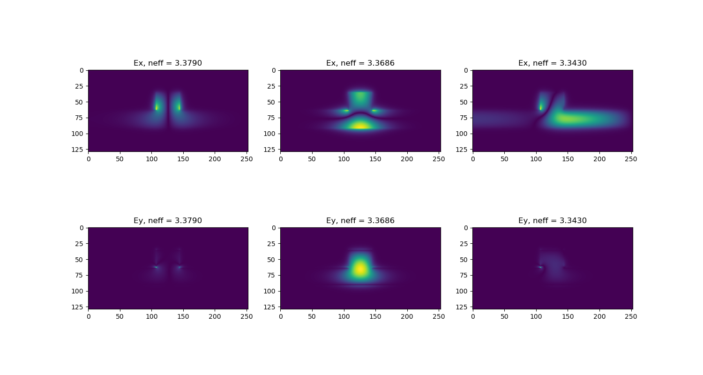

# FDFD
Finite-difference frequency-domain method python tutorial. The FDFD method refers to the Finite-Difference Frequency-Domain method, which is a numerical technique used in electromagnetics and optics to solve partial differential equations (PDEs) that describe the behavior of electromagnetic waves in a given system. It is a widely used method for simulations of various electromagnetic problems.

  

# Example
**[Yee grid](./Ch.4_Yee_grid.ipynb)**  
**[The perfectly matched layer absorbing boundary](./Ch.5_The_perfectly_matched_layer_absorbing_boundary.ipynb)**  
**[FDFD for calculating guided_modes](./Ch.6_FDFD_for_calculating_guided_modes.ipynb)**  

# Reference
[1] Raymond, C.Rumpf, Electromagnetic and Photonic Simulation for the Beginner: Finite-Difference Frequency-Domain in MATLAB (Applied Photonics Library)
